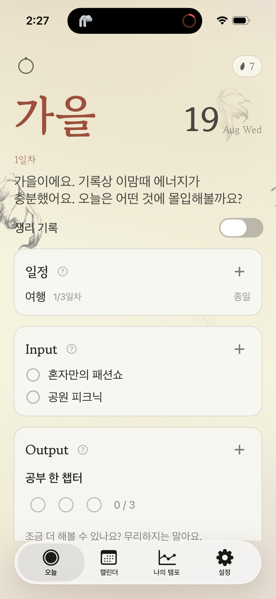
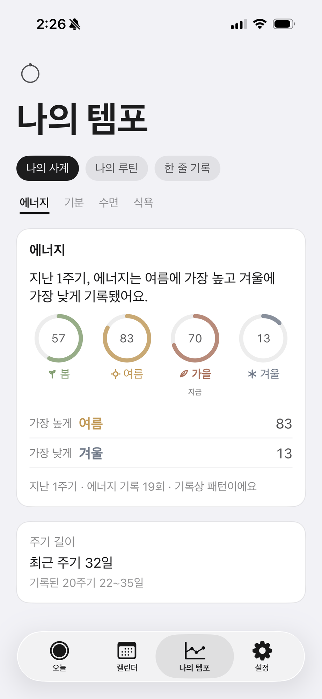

# TempoRoutine (템포루틴)

여성 호르몬 주기를 네 계절로 푼 온디바이스 iOS 루틴/플래너 앱. 태그라인 "당신 몸의 템포에 맞게."

주기를 봄·여름·가을·겨울로 바꿔 보여주고, 오늘의 계절에 맞는 강도로 하루를 계획하게 돕는다.
계정이 없고, 데이터는 기기와 사용자 개인 iCloud 밖으로 나가지 않는다. 현재 TestFlight 비공개 베타 운영 중.

<p align="center">
  
  
  
</p>
<p align="center"><sub>오늘 · 캘린더 · 나의 템포</sub></p>

## 주요 기능

- **오늘**: 계절 헤더와 오늘에 맞는 안내 카피, 일정 · Input(컨디션 케어 체크) · Output(몰입 목표 진행).
  타이머·스톱워치 Output은 잠금화면 Live Activity로 이어진다
- **캘린더**: 날짜 아래 계절 밑줄 띠, 형광펜을 긋듯 하는 생리 기록, 여러 날 일정 띠, 하루 상세, 공휴일
- **나의 템포**: 계절별 에너지·기분·수면·식욕 링 통계, 주기 길이 요약, 한 줄 기록
- **예측**: TempoCore 예측 엔진(이상 주기 필터 + 최근 주기 이동 윈도)이 계절 전환일을 계산.
  아침 브리핑·전환 예측 알림 3종(기본 켬, 끌 수 있음)
- **위젯**: 홈·잠금화면 6표면, 앱 테마 추종
- **기기 간 동기화**: CloudKit(CKSyncEngine) 레코드 미러로 iPhone과 iPad 동기화
- **테마**: 체크인으로 모으는 씨앗 재화로 잠금 해제하는 테마 시스템

## 프라이버시

- 무계정, 자체 서버 없음, 원격 텔레메트리 없음
- 생리·컨디션 데이터는 기기(SwiftData)와 사용자 개인 iCloud(CloudKit private DB)에만 저장
- HealthKit 연동은 선택 사항

## 구조

```
App/           SwiftUI 앱 타깃 (SwiftData 모델·화면·온보딩·동기화·알림)
Widgets/       위젯 익스텐션 (홈·잠금화면 6표면 + Live Activity)
Shared/        앱·위젯 공용 (App Group 스냅샷, 인텐트 브리지)
TempoCore/     순수 Foundation SPM 패키지: 예측 엔진·주기 값 타입 (SwiftData 의존 금지)
  Sources/TempoCore/
    CycleTypes.swift        CyclePhase·CycleAnchor(+커스텀 Codable)·CycleRecurrence 등
    CyclePredictor.swift    averageLength·phaseSpans·resolveDate(+overflow)·cycleDay·confidence
  Tests/TempoCoreTests/
Playground/    Step1 검증용 단일 파일 (역사 보존, SSOT는 TempoCore)
project.yml    XcodeGen 프로젝트 정의
.github/workflows/ci.yml    잡 3개: TempoCore 테스트(Linux) · 앱 빌드(macOS) · TestFlight 업로드
```

설계 SSOT는 로컬 `MASTER.md`(repo 외부), UI 시안 SSOT는 `ui-mockup/DESIGN.md`(repo 외부).

## 개발 방식

Windows에서 개발한다. 로컬에 Swift 컴파일 환경이 없어 검증 루프는 push 기반이다:

1. push하면 CI가 TempoCore 테스트(Linux 공식 Swift 컨테이너)와 앱 컴파일(macOS 러너, 무서명 아카이브)을 검증
2. 배포할 때만 TestFlight 잡을 수동 디스패치. App Store Connect cloud signing으로 서명해 업로드
3. SwiftData 스키마·권한 같은 런타임 동작은 TestFlight 실기기에서 최종 확인

## 테스트

```bash
swift test --package-path TempoCore
```
